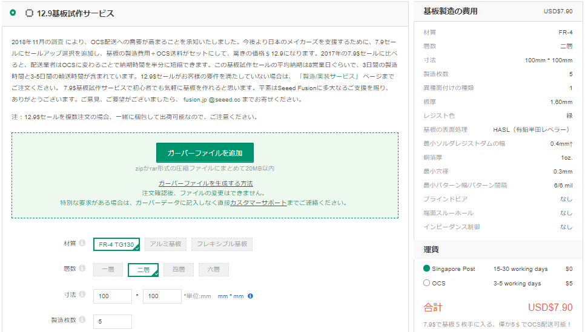
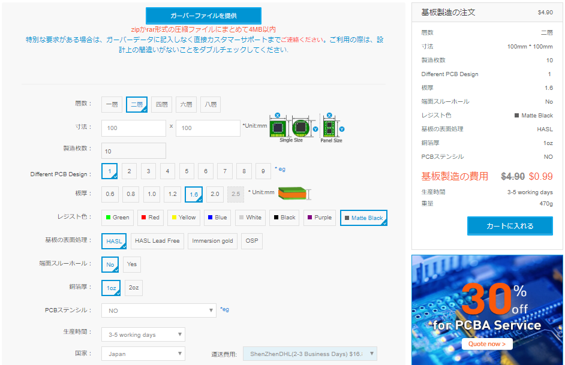

# PCBの入手方法

## FusionPCBへ発注する場合
https://www.fusionpcb.jp/prototype-pcb-sale.html

ガーバーファイルは[su120-gerber.zip](../../su120-gerber.zip)を使用します。

寸法は100×100mmです。

このリンク先から発注すると、製造枚数は5枚で固定となります。

レジスト色はお好みの色を選択してください。

## Elecrowへ発注する場合
https://www.elecrow.com/pcb-manufacturing.html

ガーバーファイルは[su120-gerber-elecrow.zip](../../su120-gerber-elecrow.zip)を使用します。

寸法は100×100mmです。

製造枚数は、5枚も10枚も費用は変わらないので、10枚にするとよいかもしれません。

レジスト色はお好みの色を選択してください。

