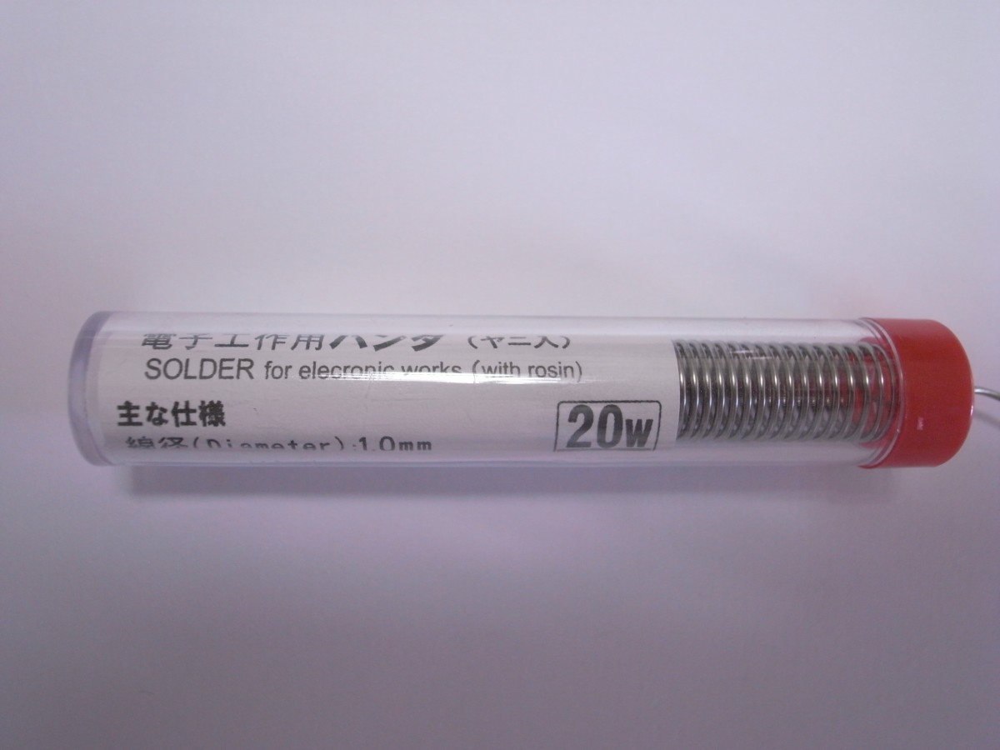
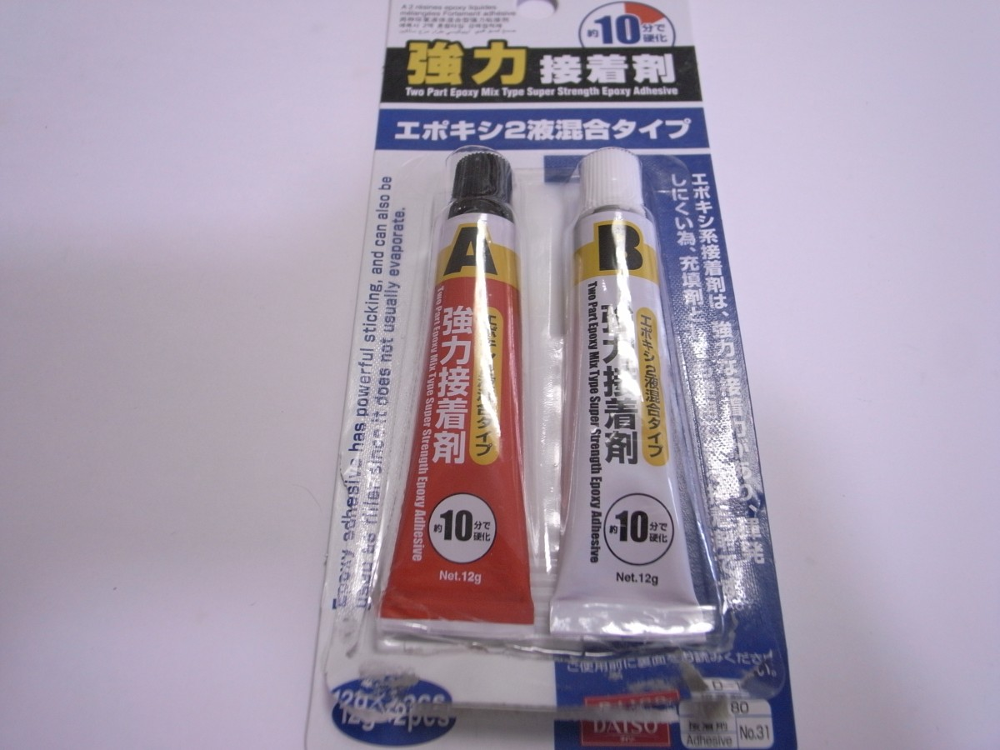

# SU120で使用する道具、消耗品

## はんだこて

ハンダ付けの経験があまりない、またはかなり前にやったという方は温度調整機能付きのものを用意されることを強くおすすめします。

> 現在、日本では趣味ではんだ付けされる方の大半が、温度調節機能のないハンダゴテを使用されています。こうしたハンダゴテはコテ先温度が450～550℃と高く上がりすぎます。このため、このハンダゴテを使ってはんだ付けしたものは、ほとんどがオーバーヒート状態になってしまいます。

[WEBはんだ付け講座 はじめに・・](https://noseseiki.com/kisokouza/01.html)より

また、はんだこてに最初から付いている円錐形のものは対象と点で当たるので熱が伝わりにくく、加熱不足ではんだを置いてしまうということがあるので、2Cのこて先に付け替え、面で加熱できるようにするとやりやすいです。

調達例
- 白光 ダイヤル式温度制御はんだこて FX600 ＆ 白光 こて先 2C型 T18-C2
- Beneges ダイヤル式 温度調節 はんだごて 5本交換コテ先付き

## はんだこて台

調達例
- 白光 セラミックヒーターはんだこて専用こて台 クリーニングスポンジ付き FH300-81

## 電子工作用ハンダ

有鉛タイプが作業しやすいです。

使う部品に小さいものはないので1mmのものでも十分作業できますが、0.8mmのものがはんだが溶けやすいようです。

100円ショップにもあります。

## ニッパー

100円ショップのものは以下の理由でおすすめしません。

- 切れ味があまり良くなく、ダイオードやPro Microの足が切りにくい
- 刃がツライチではないので、ギリギリに切れない

調達例
- エンジニア マイクロニッパー NS-04

## エポキシ接着剤 2液混合タイプ

Pro Microのもげ防止加工に使います。

100円ショップにもあります。

## マスキングテープ

ハンダ付けで基板を裏返す際に部品を固定しておくのに使います。

100円ショップにもあります（くどい）。

